# Screen Flows — Observed

**Not a `tools/crawler.py` output.** `screen-graph.mermaid` is the crawler's own
generated graph — honest about what it knows, but its edges are only
`(fixture order)` (alphabetical filename order across every `context/page_source/*.xml`
capture on disk), because `crawler.py offline` has no action-sequence history to draw
real navigation from; only a live `crawl` run records that, and this session's live
crawls only reached a narrow slice (Home → More's branch) before completing.

This file is the *actual* navigation graph — sourced directly from
`tests/screen_objects/*.py`'s own methods (`open_X()` / `close()` / `apply()` /
`go_back()` etc.), every one of which was exercised live this session as part of
building the 30+-test suite in `tests/suites/`. Each edge below is
**[OBSERVED 2026-08-10, build 15.7.2 (1272)]** — confirmed by a passing, currently-green
test that actually walks it, not inferred from static analysis of the code. If a
screen-object method exists but no passing test currently exercises it, it's noted as
such rather than asserted as confirmed.

Maintenance note: this file does not auto-update. If a screen object's navigation
methods change, update this file in the same commit — it will silently go stale
otherwise, the same risk `docs/PROJECT-STATE.md` already warns about for hand-maintained
docs.

```mermaid
graph TD
    Home["HomeScreen"]
    Properties["PropertiesResultsScreen (LPV)"]
    LocationPicker["LocationPickerScreen"]
    FullFilters["FiltersSheetScreen"]
    BuyRent["BuyRentSheet"]
    PropertyType["PropertyTypeSheet"]
    RentalFreq["RentalFrequencySheet"]
    Bedrooms["BedroomsSheet"]
    PriceRange["PriceRangeSheet"]
    TruCheckInfo["InfoPopupScreen (TruCheck)"]
    DPV["ListingDetailScreen (DPV)"]
    More["MoreScreen"]
    ActivityLog["ActivityLogScreen"]
    Favourites["FavouritesScreen"]
    SignInMethod["SignInMethodScreen"]
    CachedLogin["CachedLoginScreen (Keycloak interstitial)"]
    EmailLogin["EmailLoginScreen"]
    FindMyAgentHub["FindMyAgentHubScreen"]
    AgencyDetail["AgencyDetailScreen"]
    AgentProfile["AgentProfileScreen"]

    Home -->|"open_properties()"| Properties
    Home -->|"open_more()"| More
    Home -->|"open_location_search()"| LocationPicker

    Properties -->|"open_location_picker()"| LocationPicker
    Properties -->|"open_full_filters()"| FullFilters
    Properties -->|"open_buy_rent_picker()"| BuyRent
    Properties -->|"open_property_type_picker()"| PropertyType
    Properties -->|"open_rental_frequency_picker()"| RentalFreq
    Properties -->|"open_bedrooms_picker()"| Bedrooms
    Properties -->|"open_price_range_picker()"| PriceRange
    Properties -->|"open_trucheck_info()"| TruCheckInfo
    Properties -->|"open_first_listing()"| DPV
    Properties -->|"favourite_nth_listing() [tap_at(), stays on screen]"| Properties

    LocationPicker -->|"close()"| Properties
    LocationPicker -->|"confirm() [lands on Filters, not results]"| FullFilters

    FullFilters -->|"show_results()"| Properties
    FullFilters -->|"close()"| Properties

    BuyRent -->|"dismiss() [back gesture, scrim is UNCERTAIN]"| Properties
    PropertyType -->|"apply()"| Properties
    RentalFreq -->|"apply()"| Properties
    Bedrooms -->|"apply()"| Properties
    PriceRange -->|"apply()"| Properties
    TruCheckInfo -->|"dismiss() [back gesture, scrim is UNCERTAIN]"| Properties

    DPV -->|"go_back()"| Properties

    More -->|"open_activity_log()"| ActivityLog
    More -->|"open_favourites()"| Favourites
    More -->|"open_sign_in() [CONSEQUENTIAL]"| SignInMethod
    More -->|"open_find_my_agent()"| FindMyAgentHub

    ActivityLog -->|"go_back()"| More
    Favourites -->|"go_back()"| More

    SignInMethod -->|"continue_with_email() [no cached login]"| EmailLogin
    SignInMethod -->|"continue_with_email() [cached login present]"| CachedLogin
    CachedLogin -->|"login_with_another_account()"| EmailLogin
    EmailLogin -.->|"login_with_email_password() [CONSEQUENTIAL, returns None — caller re-navigates via home_screen.open_more() afterward, not a method return]"| Home

    FindMyAgentHub -->|"open_first_agency_result()"| AgencyDetail
    AgencyDetail -->|"open_agent()"| AgentProfile
    AgentProfile -->|"open_agency_link()"| FindMyAgentHub
```

## Screens with no outgoing edges confirmed live yet

These screen objects exist and are used for content assertions, but no currently-passing
test exercises a further navigation *out* of them beyond what's shown above (e.g. no test
opens a listing from Favourites the way it does from Properties). Not asserting an edge
that hasn't actually been walked:

- `AgentProfileScreen.go_back()` exists in code but isn't called by any current test.
- `AgencyDetailScreen.open_nth_property()` opens a DPV-like flow but doesn't return a
  typed screen object in the current implementation — the caller re-derives context
  manually (see `05_leads/consequential/test_email_lead_marks_contacted.py`).

## Consequential edges — gated, not part of the default suite

Two edges above are marked `[CONSEQUENTIAL]`: `More.open_sign_in()` → sign-in flow, and
`EmailLoginScreen.login_with_email_password()` → back to Home signed in. Both only run
under `RUN_CONSEQUENTIAL_TESTS=1` (`tests/suites/04_sign_in_up/consequential/`) — see
`docs/DECISIONS.md` D-024, D-027 for why signing out/in needs `deliberate_tap()` rather
than the default `safe_tap()` gate.
